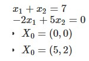
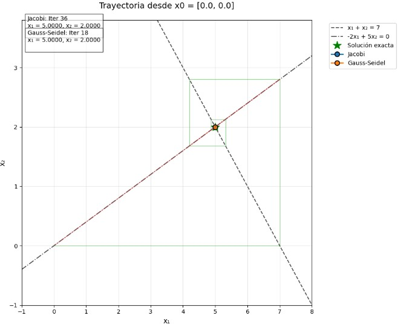
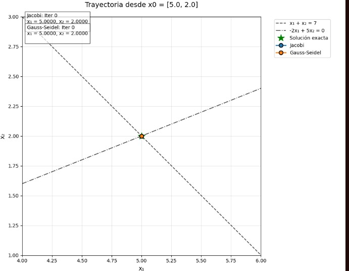
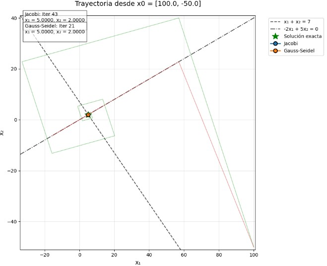
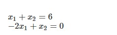
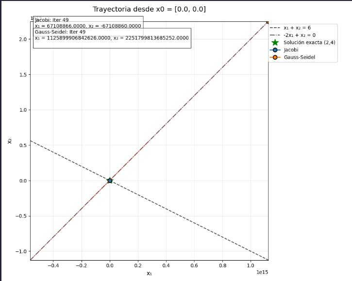
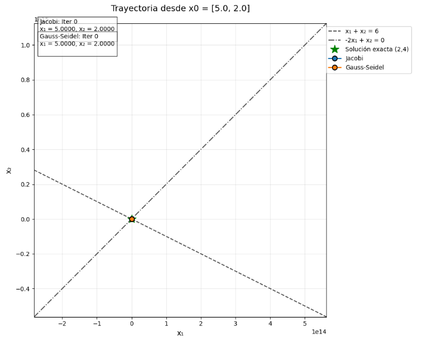
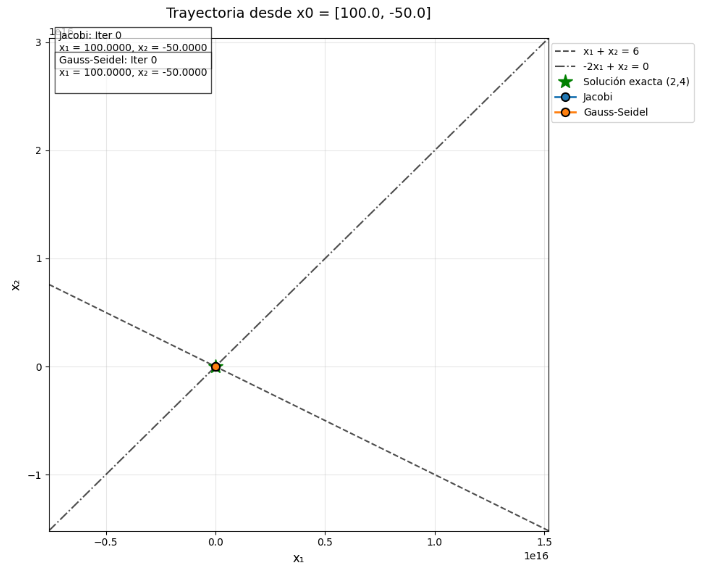

# [Taller 2b] Métodos iterativos
- Jairo Angulo 
- Richard Tipantiza

[Repositorio](https://github.com/keyaru18/TallerMetodosIterativos.git)

## Grafique la trayectoria de los siguientes sistemas de ecuaciones
## Ejercicio 1:

### 1. (0, 0)

### 2. (5, 2)

### 3. (100, -50)

## Ejercicio 2:

### 1. (0, 0)

### 2. (5, 2)

### 3. (100, -50)

